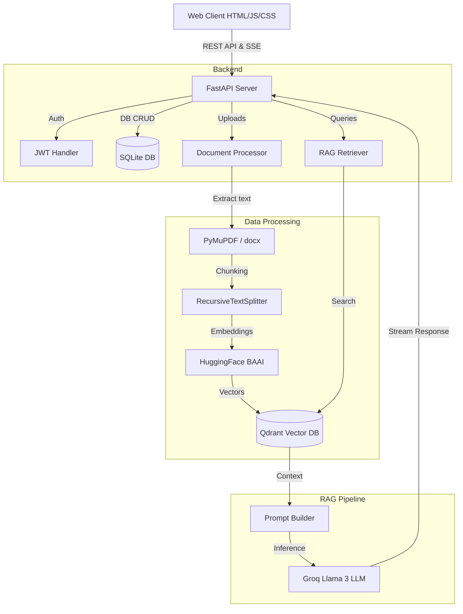
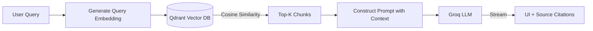

<div align="center">

# 🚀 Enterprise AI Copilot

[](https://python.org)
[](https://fastapi.tiangolo.com/)
[](https://langchain.com/)
[](https://groq.com/)
[]()
[]()
[]()
[]()
[](https://opensource.org/licenses/MIT)

**A production-quality Retrieval-Augmented Generation (RAG) application empowering teams to extract insights from corporate documents seamlessly via an intelligent, ChatGPT-style interface.**


</div>

---

## 📑 Table of Contents

- [Features](#-features)
- [Architecture](#-architecture)
- [Tech Stack](#-tech-stack)
- [Project Structure](#-project-structure)
- [Installation](#-installation)
- [Environment Variables](#-environment-variables)
- [API Endpoints](#-api-endpoints)
- [RAG Pipeline](#-rag-pipeline)
- [Project Workflow](#-project-workflow)
- [Screenshots](#-screenshots)
- [Deployment](#-deployment)
- [Security Features](#-security-features)
- [Performance Features](#-performance-features)
- [Future Improvements](#-future-improvements)
- [License](#-license)
- [Author & Contact](#-author--contact)
- [Acknowledgements](#-acknowledgements)

---

## ✨ Features

- **🔐 Secure Authentication** — JWT-based login and user registration mechanisms with hashed passwords.
- **📄 Multi-Format Document Ingestion** — Robust ingestion of `PDF`, `DOCX`, `TXT`, `CSV`, and `XLSX` files via drag-and-drop.
- **📊 Dynamic Data Analytics & Charts** — Automatic analysis of tabular datasets (CSV/XLSX) generating executive summaries, statistical tables, and inline charts (Histogram, Bar, Scatter, Heatmap, Line) powered by Matplotlib & Seaborn.
- **🤖 Intelligent RAG Chat** — Chat naturally with your business data, powered by advanced LangChain workflows and Groq LLMs.
- **📝 Precise Source Citations** — AI responses map directly to document snippets, providing transparency and trust.
- **💬 Persistent Chat History** — Securely tracks and retrieves previous conversational threads using SQLite/SQLAlchemy.
- **🔍 Seamless Document Management** — View, manage, and delete ingested documents from the knowledge base.
- **⚙️ Dynamic AI Settings** — User-facing controls to adjust Model, Temperature, and Max Tokens on the fly.
- **🌙 Glassmorphism UI** — A modern, fully responsive Dark/Light mode interface delivering a premium UX.

---

## 🏗️ Architecture



---

## 💻 Tech Stack

| Layer | Technology | Purpose |
|-------|------------|---------|
| **Backend Framework** | FastAPI | High-performance async API server |
| **AI Framework** | LangChain | RAG pipeline orchestration |
| **LLM Provider** | Groq / OpenAI | Fast inference engine |
| **Embedding Model** | HuggingFace `BAAI/bge-base` | Transforming text into vectors |
| **Vector Database** | Qdrant | Fast similarity search |
| **Relational DB** | SQLite + SQLAlchemy | User, Session, and Metadata storage |
| **Frontend UI** | Vanilla HTML, CSS, JS | Lightweight, dynamic user interface |

---

## 📁 Project Structure

```text
enterprise-ai-copilot/
├── backend/
│   ├── api/                 # FastAPI routers (auth, chat, documents)
│   ├── auth/                # JWT utilities and password hashing
│   ├── models/              # SQLAlchemy database models
│   ├── rag/                 # RAG pipeline logic (chunking, embeddings, LLM)
│   ├── schemas/             # Pydantic validation models
│   ├── utils/               # Logging and file helpers
│   ├── config.py            # Global environment configuration
│   ├── database.py          # Relational DB session management
│   └── main.py              # Application entry point
├── frontend/
│   ├── assets/              # Static images and icons
│   ├── css/                 # Stylesheets (base, layout, components)
│   ├── js/                  # Client-side scripts (api, chat, dashboard)
│   ├── dashboard.html       # Main application view
│   ├── index.html           # Login screen
│   └── signup.html          # Registration screen
├── uploads/                 # Local directory for raw file storage
├── vector_db/               # Qdrant persistent storage directory
├── .env.example             # Template for environment variables
├── pyrefly.toml             # Pyrefly typing configuration
├── requirements.txt         # Python dependencies
└── README.md                # Project documentation
```

---

## 🚀 Installation

Follow these steps to run the project locally.

### 1. Clone the repository
```bash
git clone https://github.com/mahimachauhan17/Enterprise-AI-Copilot.git
cd Enterprise-AI-Copilot
```

### 2. Create a Virtual Environment
```bash
python -m venv venv

# On Windows
venv\Scripts\activate

# On macOS/Linux
source venv/bin/activate
```

### 3. Install Dependencies
```bash
pip install -r requirements.txt
```

### 4. Configure Environment Variables
Copy the example environment file and fill in your details:
```bash
cp .env.example .env
```
*(Ensure you add your Groq API Key into the `.env` file)*

### 5. Run the Backend Server
```bash
python -m uvicorn backend.main:app --host 0.0.0.0 --port 8000 --reload
```

The application will be accessible at [http://localhost:8000](http:S//localhost:8000).

---

## 🔐 Environment Variables

The system relies on a `.env` file at the root level. Below are the required keys:

| Variable | Description | Example |
|----------|-------------|---------|
| `GROQ_API_KEY` | Your Groq API key for LLM inference | `gsk_...` |
| `LLM_PROVIDER` | The LLM provider to use | `groq` |
| `LLM_MODEL` | The specific model identifier | `llama-3.3-70b-versatile` |
| `EMBEDDING_MODEL` | HuggingFace embedding model | `BAAI/bge-base-en-v1.5` |
| `JWT_SECRET` | Secret used to sign authentication tokens | `your_super_secret_key` |
| `JWT_ALGORITHM` | Hashing algorithm for JWT | `HS256` |
| `JWT_EXPIRATION_HOURS`| Token validity duration | `24` |
| `MAX_UPLOAD_SIZE_MB` | Maximum allowed document size | `50` |

---

## 🌐 API Endpoints

| Method | Endpoint | Description | Auth Required |
|--------|----------|-------------|---------------|
| **POST** | `/api/signup` | Register a new user | ❌ |
| **POST** | `/api/login` | Authenticate and retrieve JWT | ❌ |
| **POST** | `/api/upload` | Ingest and vectorize files | ✅ |
| **POST** | `/api/chat` | Query RAG pipeline (Server-Sent Events) | ✅ |
| **GET** | `/api/documents` | Retrieve user's uploaded documents | ✅ |
| **DELETE**| `/api/document/{id}` | Delete a document and its vectors | ✅ |
| **GET** | `/api/history` | List user's conversation threads | ✅ |
| **GET** | `/api/history/{id}` | Get messages for a specific thread | ✅ |
| **DELETE**| `/api/history/{id}` | Delete a specific conversation thread | ✅ |
| **DELETE**| `/api/history` | Clear all user conversation history | ✅ |

---

## 📸 Screenshots

### Login Page


### Signup Page


### Dashboard Overview


### Chat Interface with Citations


### Document Upload


---

## 🧠 RAG Pipeline



1. **Ingestion:** Uploaded documents are parsed via PyMuPDF/python-docx, split using `RecursiveCharacterTextSplitter`, embedded using `BAAI/bge-base`, and stored in Qdrant.
2. **Retrieval:** User queries are embedded and compared against the Qdrant database using Cosine Similarity.
3. **Generation:** The top matching chunks are injected into a strict system prompt.
4. **Streaming:** The Groq LLM streams the answer back to the frontend in real-time, accompanied by exact source mappings.

---

## 🔄 Project Workflow

1. **Authentication:** User creates an account and logs in to receive a JWT.
2. **Knowledge Base Population:** User uploads company policies, handbooks, or reports.
3. **Processing:** The backend extracts text, chunks it, generates embeddings, and saves it to the vector store.
4. **Interrogation:** User asks a question via the chat interface.
5. **Retrieval:** The backend fetches the most semantically relevant document chunks.
6. **Response:** The AI reads the chunks and formulates an accurate answer, providing source badges pointing back to the original documents.

---

## ☁️ Deployment

### 1. Vercel (Frontend)
The frontend UI is fully decoupled and ready for Vercel. 
- Ensure `vercel.json` is configured to rewrite `/api/*` routes to your backend service URL.
- Update `API_BASE` in `frontend/js/api.js` if deploying separately.

### 2. Render / Railway (Backend)
FastAPI can be easily deployed to Render or Railway as a Web Service.
- **Build Command:** `pip install -r requirements.txt`
- **Start Command:** `uvicorn backend.main:app --host 0.0.0.0 --port $PORT`

### 3. Supabase (Database)
Swap the default SQLite database with PostgreSQL for production scale. Update the SQLAlchemy URL in `backend/database.py` to point to a Supabase connection string.

### 4. Qdrant Cloud (Vector DB)
For distributed, high-availability vector search, replace the local Qdrant client path with a Qdrant Cloud URL and API Key in `backend/rag/vector_store.py`.

---

## 🛡️ Security Features

- **Password Cryptography:** Secure `bcrypt` hashing via `passlib`.
- **Stateless Auth:** Secure JSON Web Tokens (JWT) ensuring horizontal scalability.
- **Data Isolation:** All vector embeddings and chat histories are strictly partitioned by `user_id`.
- **CORS Mitigation:** FastAPIs `CORSMiddleware` configured to restrict cross-origin anomalies.
- **Input Sanitization:** Strong schema validation using Pydantic preventing injection attacks.

---

## ⚡ Performance Features

- **Asynchronous IO:** Built entirely on FastAPI allowing high-throughput concurrent requests.
- **Server-Sent Events (SSE):** Streaming LLM tokens directly to the client, reducing perceived latency to milliseconds.
- **Groq Inference Engine:** Utilizing LPU architecture for hyper-fast token generation.
- **Debounced Searching:** Client-side debouncing for document search ensuring smooth UI rendering.
- **Efficient Chunking:** Overlap-aware recursive chunking to retain semantic context without overwhelming context windows.

---

## 🔮 Future Improvements

- [ ] Implement OCR for image-based PDFs.
- [ ] Add conversation branching and editing.
- [ ] Multi-user collaborative workspaces (RBAC).
- [ ] Export chat history to PDF/Markdown.
- [ ] Integration with Slack / Microsoft Teams.

---

## 📄 License

This project is licensed under the **MIT License**. See the [LICENSE](LICENSE) file for details.

---

## 👨‍💻 Author & Contact

**Mahima Chauhan**
- 🐙 GitHub: [@mahimachauhan17](https://github.com/mahimachauhan17)


---

## 🙏 Acknowledgements

- The amazing teams at [FastAPI](https://fastapi.tiangolo.com/), [LangChain](https://langchain.com/), and [Qdrant](https://qdrant.tech/).
- [Groq](https://groq.com/) for incredibly fast LLM inference.
- [HuggingFace](https://huggingface.co/) for open-source embedding models.
- The open-source AI community.
